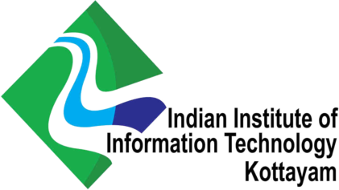
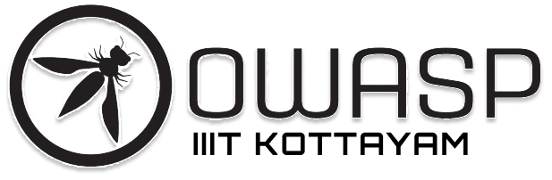
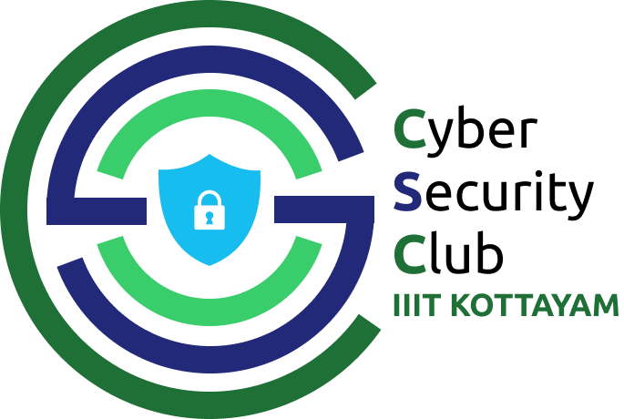

---

layout: col-sidebar
title: OWASP Indian Institute of Information Technology Kottayam
tags: example-tag
region: Asia
country: India
meetup-group:

---

  
  
  

 <b style="text-align:center; text-font:15px ">HAPPY FORMATION DAY</b> 
## Welcome

Greetings Cybersecurity Enthusiasts!

We are delighted to extend a warm welcome to you on the official webpage of IIIT-Kottayam. As a proud affiliate of the Open Web Application Security Project (OWASP), our commitment is unwavering in fostering a vibrant community of cybersecurity professionals and enthusiasts. We are united by a shared passion for securing web applications and advocating for the best practices in cybersecurity.

At IIIT-K, our mission is unequivocal: to empower both individuals and organizations in the endeavor to build, maintain, and operate secure web applications. In the dynamic landscape of ever-evolving cyber threats, our community serves as a steadfast stronghold. We pride ourselves on being a nexus for knowledge-sharing, collaboration, and a hub for continuous learning.

Join us in our collective journey to navigate the complexities of cybersecurity, where every member contributes to the resilience of our digital ecosystems. Together, we stand as a united force dedicated to advancing the field of web application security, ensuring a safer and more secure digital future for all.
  

## Participation

Everyone is welcome and encouraged to participate in our diverse range of initiatives. Whether you're interested in contributing to impactful [Projects](/projects/), engaging with our [Local Chapters](/chapters/), attending enlightening [Events](/events/),  joining discussions on [Online Groups](https://groups.google.com/a/owasp.com/){:target='_blank'}, or collaborating in real-time on our [Community Slack Channel](https://owasp.slack.com/){:target='_blank'}– your involvement is key to our collective success. 

Embracing diversity is at the core of our initiatives, and we invite individuals from all backgrounds to join our community. OWASP provides an exceptional platform to learn about application security, expand your professional network, and establish yourself as an expert in the field. Consider taking the next step by [become a member](/membership/)  or making a valuable [donation](/donate/) to support our ongoing efforts. Your active participation contributes to the resilience and strength of our community, making a lasting impact on the broader landscape of cybersecurity.



