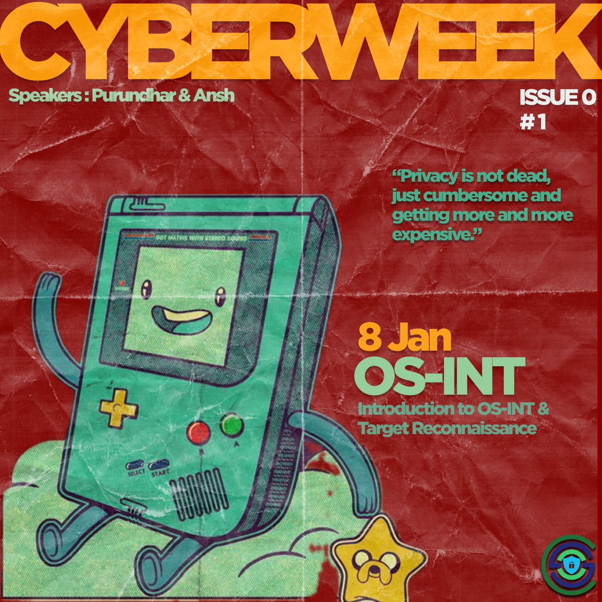

## Upcoming Events

### DAY - 1: Introduction to OSINT and Target Reconnaissance

We would go from knowing minimal information about a potential target to gaining maximum information from the public domain. Creating a personalized Phishing email to the target to gain credential access from them.

### DAY 2 (Priyatham) - Network Scanning

Nmap, a potent network scanning tool, is crucial for discovering hosts and vulnerabilities.

### DAY 3 - EXPLOITATION TOOLS (Purandhar and Ansh)

Brief look through popular Exploitation tools e.g., John the Ripper, BeEF project. Demonstration of keyloggers and other cybersecurity vulnerabilities.

### DAY 4 - WEB (Gaurav Jain)

- Basics of web and HTTP
- Introduction to Cross Site Scripting
- Leverage XSS to steal cookies (live demo!) - session hijacking
- Popular tools to find and exploit XSS - XSSer, XSStrike, etc.

### DAY 5 - CTF (Gaurav Jain)

- Introduction to CTF
- Other interesting domains of CTF - Reverse Engineering, Binary Exploitation, etc.
- Introduction to popular CTF practice websites (tryhackme, picoCTF, hackthebox)

## Past Events

(To Be Decided)
