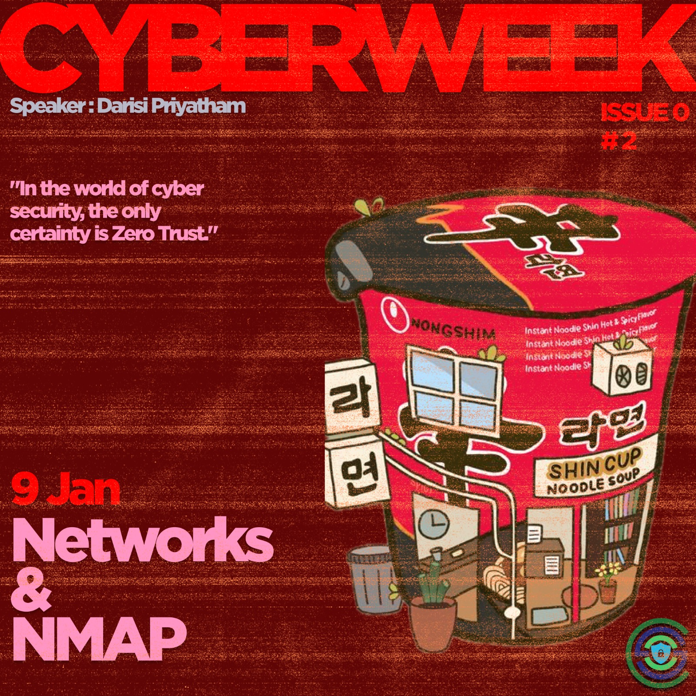
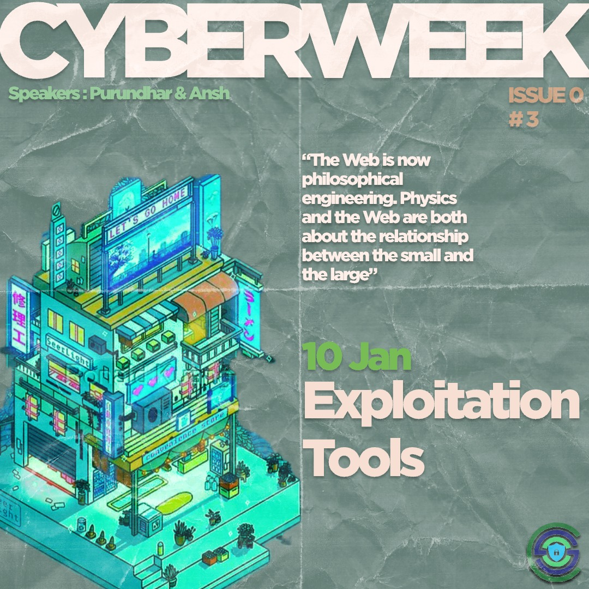
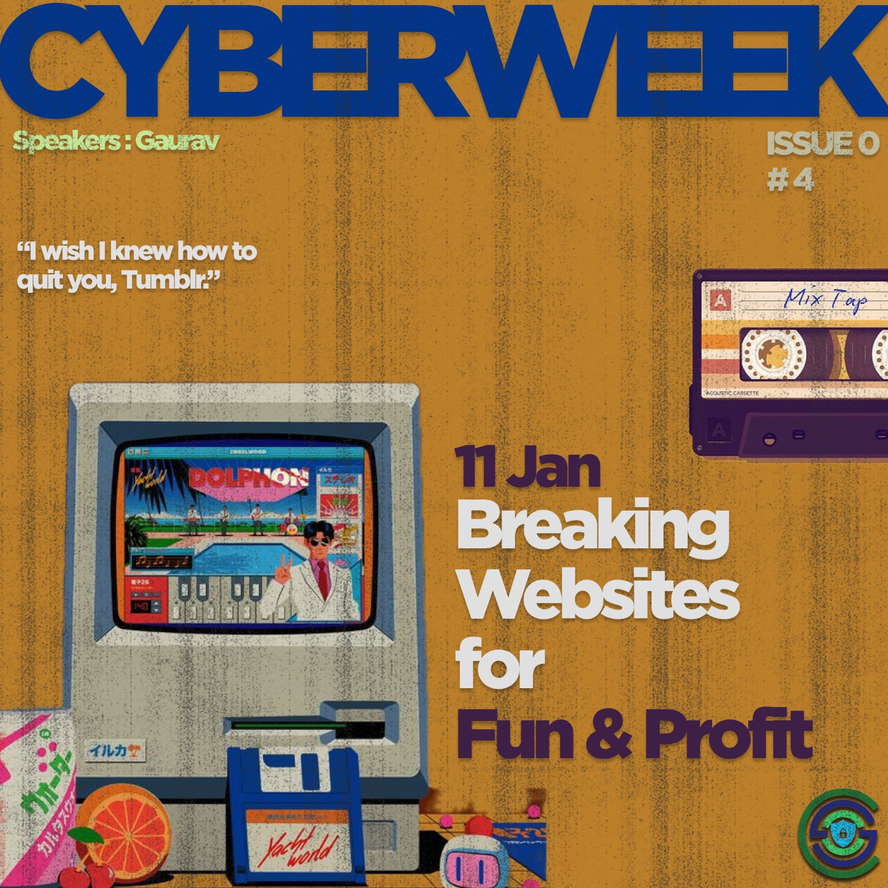
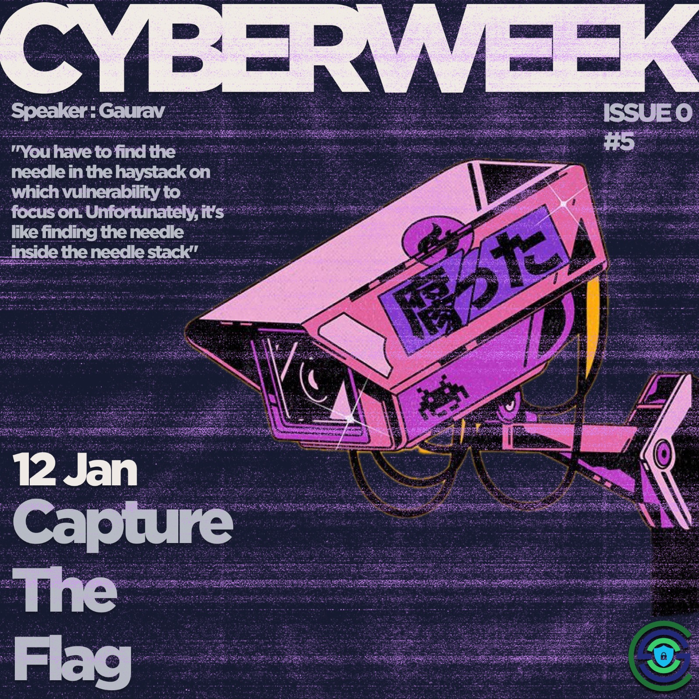

## Upcoming Events

  

    ** DAY-1: Introduction to OSINT and Target Reconnaissance (Purundhar, Ansh) **  

    We would go from knowing minimal information about a potential target to gaining maximum information from the public domain. Creating a personalized Phishing email to the target to gain credential access from them.
  

  

    
  

  

    ** DAY-2 : Network Scanning & NMAP (Priyatham) **  

    Nmap, a potent network scanning tool, is crucial for discovering hosts and vulnerabilities.
  

  

    
  

  

    ** DAY-3 : Exploitation Tools (Purundhar, Ansh) **  

    Brief look through popular Exploitation tools e.g., John the Ripper, BeEF project. Demonstration of keyloggers and other cybersecurity vulnerabilities.
  

  

    
  

  

    ** DAY-4 : Breaking Websites (Gaurav Jain) **  

    - Basics of web and HTTP  
    - Introduction to Cross Site Scripting  
    - Leverage XSS to steal cookies (live demo!) - session hijacking  
    - Popular tools to find and exploit XSS - XSSer, XSStrike, etc.
  

  

    
  

  

    ** DAY 5 - Capture The Flag (Gaurav Jain) **  

    - Introduction to CTF  
    - Other interesting domains of CTF - Reverse Engineering, Binary Exploitation, etc.  
    - Introduction to popular CTF practice websites (tryhackme, picoCTF, hackthebox)
  

  

    
  

## Past Events

(To Be Decided)
