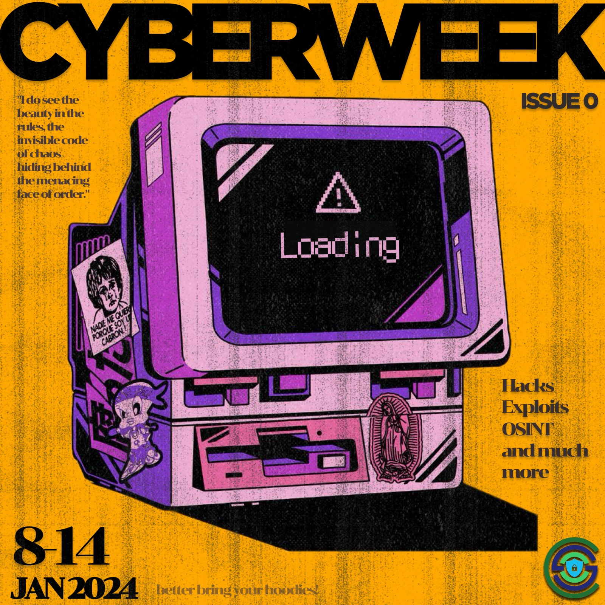

## Upcoming Events

 
 <strong> CYBERWEEK (8 Jan 2024 - 14 Jan 2024) </strong> 
   
 

  

    <strong> DAY-1: Introduction to OSINT and Target Reconnaissance  </strong> 
    (Speakers: Purundhar, Ansh)  
    - We would go from knowing minimal information about a potential target to gaining maximum information from the public domain.  
    - Creating a personalized Phishing email to the target to gain credential access from them.
  

  

    
  

  

    <strong> DAY-2 : Network Scanning & NMAP </strong> 
    (Speaker: Darisi Priyatham)   
    - Nmap, a potent network scanning tool, is crucial for discovering hosts and vulnerabilities.
   Operating within networks, which range from local to global scales, it assesses security by
   revealing open ports and facilitating communication and resource sharing.

  

  

    
  

  

    <strong> DAY-3 : Exploitation Tools </strong> 
    (Speakers: Purundhar, Ansh)  
    - Brief look through popular Exploitation tools e.g., John the Ripper, BeEF project.  
    - Demonstration of keyloggers and other cybersecurity vulnerabilities.
  

  

    
  

  

    <strong> DAY-4 : Breaking Websites </strong> 
      (Speaker: Gaurav Jain)   
    - Basics of web and HTTP  
    - Introduction to Cross Site Scripting  
    - Leverage XSS to steal cookies (live demo!) - session hijacking  
    - Popular tools to find and exploit XSS - XSSer, XSStrike, etc.
  

  

    
  

  

    <strong> DAY 5 - Capture The Flag </strong>  
      (Speaker: Gaurav Jain)   
    - Introduction to CTF  
    - Other interesting domains of CTF - Reverse Engineering, Binary Exploitation, etc.  
    - Introduction to popular CTF practice websites (tryhackme, picoCTF, hackthebox)
  

  

    
  

## Past Events

(To Be Decided)
